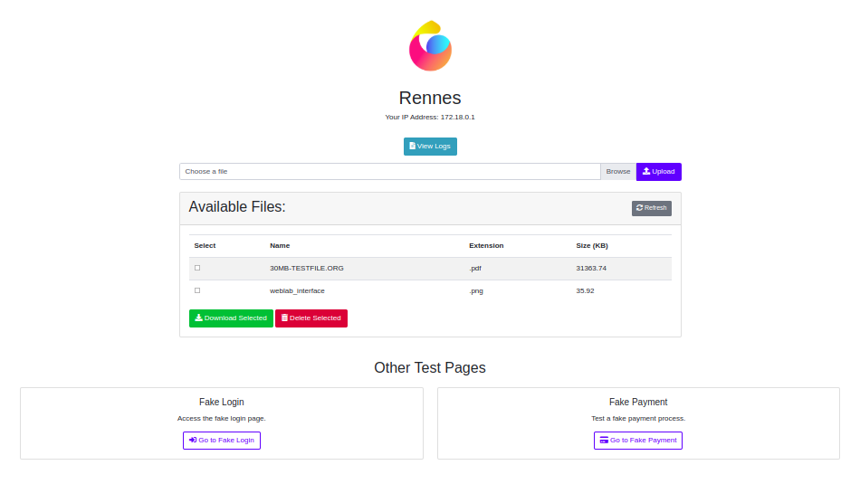

# WebLab

A lightweight web server application for demonstration and testing purposes.

 

## Description

WebLab is a simple and practical web server designed to provide a quick and easy environment for:

* Creating system, network, and security scenarios
* Testing web application functionality
* Experimenting with file handling
* Analyzing server logs
* Simulating user authentication and payment processes

It is built using Flask (a Python web framework) and is containerized with Docker for easy deployment and portability.

## Features

### File Management

 

* Upload files to the server.
* Download existing files.
* View a list of available files with details (name, extension, size).
* Delete selected files.

### Log Viewing


* Display server logs in a user-friendly web interface.
* Search and highlight specific log entries.
* Navigate through search results.
* Clear the logs.

### Fake Login Page


* Simulates a login page for testing authentication scenarios.
* Provides a demonstration account for easy access.

### Fake Payment Page


* Simulates a payment processing page for testing transaction flows.
* Includes fields for credit card information.
* Provides an option to auto-fill the form with test data.

### User Interface

* Clean and intuitive web interface built with Bootstrap.

### Dockerized Deployment

* Easy setup and deployment using Docker and Docker Compose.

## Technologies Used

* [Flask](https://flask.palletsprojects.com/): A Python web framework
* [Bootstrap](https://getbootstrap.com/): A CSS framework for the user interface
* [Font Awesome](https://fontawesome.com/): An icon library
* [Python](https://www.python.org/): The programming language
* [Docker](https://www.docker.com/): A platform for containerization

## Getting Started

### Prerequisites

* [Docker](https://www.docker.com/get-started) and [Docker Compose](https://docs.docker.com/compose/install/) installed on your machine.

### Installation

1.  Clone the repository:

    ```bash
    git clone https://github.com/ClementLG/WebLab.git
    ```

2.  Navigate to the project directory:

    ```bash
    cd WebLab
    ```

3.  Build and run the application using Docker Compose:

    ```bash
    docker-compose up
    ```

4.  Access the application in your web browser at `http://<server_IP>:5000`.

### Environment Variables

The following environment variables can be configured in the `docker-compose.yml` file:

* `FLASK_APP`: Specifies the name of the Flask application file (default: `app.py`).
* `FLASK_ENV`: Sets the Flask environment (e.g., `development` or `production`).
* `LOCATION_NAME`: Sets the location name displayed in the application's interface.

## Usage

* **File Upload:** Use the file upload form on the main page to upload files to the server.
* **File Download/Delete:** Select files from the list and use the buttons to download or delete them.
* **Log Viewing:** Access the logs through the "View Logs" link on the main page. Use the search functionality to find specific entries.
* **Fake Login:** Navigate to the login page through the link on the main page. Use the provided demo credentials to log in.
* **Fake Payment:** Navigate to the payment page through the link on the main page. Fill in the payment details or use the auto-fill button for test data.

## Architecture
```
WebLab/
├── web_app/         # Directory containing the Flask application
│   ├── app.py       #   The main Flask application file
│   ├── templates/   #   Directory containing HTML files (templates)
│   │   ├── index.html #       The homepage with file management
│   │   ├── logs.html  #       The log display page
│   │   ├── login.html #       The fake login page
│   │   ├── payment.html #     The fake payment page
│   │   └── payment_result.html # The fake payment result page
│   └── static/      #   Directory containing static files (CSS, images, JS)
│   │   └── img/       #       Directory containing images
│   │       └── logo.png #           The application's logo
├── Dockerfile       # The Dockerfile to build the image
├── docker-compose.yml # The Docker Compose file to orchestrate the container
├── requirements.txt # The file listing Python dependencies
└── README.md        # The README file describing the project
```
